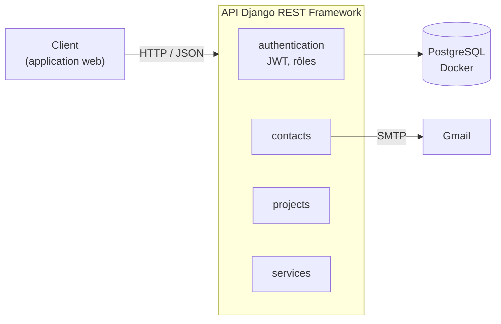

# 🚀 DigitalFlow — Enterprise Backend API


Plateforme de **digitalisation des entreprises et de gestion des demandes clients**. Elle permet à une entreprise de présenter ses services et ses réalisations, et de traiter automatiquement les demandes reçues. Le backend est modulaire, robuste et sécurisé.

## Sommaire

- [Fonctionnalités](#-fonctionnalités)
- [Architecture](#️-architecture)
- [Stack technique](#️-stack-technique)
- [Structure du projet](#-structure-du-projet)
- [Installation](#-installation-et-lancement-en-local)
- [Auteure](#-auteure)

## ✨ Fonctionnalités

- **Authentification sécurisée** : gestion des utilisateurs et des rôles, connexion par JWT
- **Demandes clients** : formulaire de contact avec envoi d'e-mails automatisé (SMTP Gmail)
- **Portfolio** : gestion des réalisations de l'entreprise
- **Catalogue de services** : gestion des services professionnels proposés
- **Espace administrateur** pour gérer les contenus

## 🏗️ Architecture



## 🛠️ Stack technique

| Domaine | Technologies |
|---|---|
| Framework backend | Django, Django REST Framework (DRF) |
| Base de données | PostgreSQL (conteneurisé avec Docker) |
| Authentification et sécurité | JWT (JSON Web Tokens) |
| Notifications | SMTP Gmail (envoi automatique des formulaires de contact) |
| Environnement et versionnage | Git, Python venv, fichier `.env` |

## 📁 Structure du projet

```
Back/
├── authentication/    # Utilisateurs, rôles et authentification JWT
├── contacts/          # Formulaires de contact et envoi d'e-mails SMTP
├── projects/          # Portfolio et réalisations de l'entreprise
├── services/          # Catalogue des services professionnels
├── config/            # Paramètres globaux (settings.py, urls.py)
├── docker-compose.yml # Service PostgreSQL
└── requirements.txt   # Dépendances Python
```

## ⚙️ Installation et lancement en local

### Prérequis

Python 3, Docker et Git.

### 1. Cloner le dépôt

```bash
git clone https://github.com/BouoniManar/digitalflow-enterprise.git
cd digitalflow-enterprise/Back
```

### 2. Démarrer PostgreSQL

```bash
docker compose up -d
```

### 3. Configurer l'environnement

Créer un fichier `.env` à la racine de `Back/` avec :

- la clé secrète Django,
- les accès à la base PostgreSQL (identiques à ceux de `docker-compose.yml`),
- les identifiants SMTP Gmail (utiliser un **mot de passe d'application** Google, jamais le mot de passe du compte).

> Le fichier `.env` ne doit jamais être publié sur GitHub.

### 4. Installer les dépendances

```bash
python -m venv venv
venv\Scripts\activate             # Windows (PowerShell)
pip install -r requirements.txt
```

### 5. Migrations et lancement

```bash
python manage.py migrate
python manage.py createsuperuser  # compte administrateur
python manage.py runserver
```

L'API est disponible sur `http://127.0.0.1:8000/`.

<!--
## 📸 Captures d'écran
Ajoute tes images dans un dossier docs/ puis décommente ce bloc :


-->

## 👩‍💻 Auteure

**Manar Bouoni** — Développeuse Full Stack
[GitHub](https://github.com/BouoniManar) · [LinkedIn](https://linkedin.com/in/bouoni-manar-700b90222)
